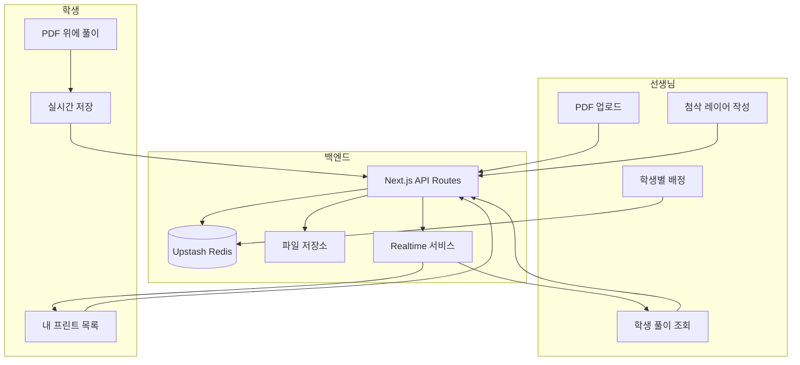

# 실시간 PDF 풀이·첨삭 시스템

가능합니다. 현재 스택(Next.js 16, Vercel, pdfjs-dist, Upstash Redis)을 활용하고, 실시간 동기화를 위해 외부 Realtime 서비스를 추가하는 방향으로 설계할 수 있습니다.

---

## 아키텍처 개요




---

## 핵심 구성요소

### 1. PDF + 풀이 캔버스 (굿노트 스타일)

- **PDF 렌더링**: 기존 [pdfjs-dist](front/package.json) 활용
- **풀이 레이어**: PDF 위에 겹치는 HTML Canvas로 자유곡선(freehand) 그리기
- **저장 형식**: 스트로크를 `{ points: [{x,y}], color, width, pageIndex }[]` 형태로 JSON 직렬화

대안: [Fabric.js](https://fabricjs.com)로 PDF 배경 이미지 위에 그리기 (확대/축소·이동 시 좌표 동기화 필요). 초기에는 순수 Canvas API로 시작해도 충분함.

### 2. 파일 저장소

현재 Vercel Blob 또는 별도 스토리지가 없음. 다음 중 택1 필요:

- **Vercel Blob** (가장 단순): `@vercel/blob` 패키지, 무료 1GB
- **Cloudflare R2** / **Supabase Storage**: 비용·확장성 고려 시

업로드된 PDF와 각 페이지 스냅샷(썸네일용) 저장에 사용.

### 3. 데이터 저장 (Redis vs DB)


| 데이터               | Redis | 비고                         |
| ----------------- | ----- | -------------------------- |
| 과제 배정 (학생↔PDF 매핑) | O     | `assignment:{id}` 형태       |
| 학생 풀이 스트로크        | 주의    | JSON 크기 제한(512KB/value) 있음 |
| 선생님 첨삭 스트로크       | 주의    | 동일                         |


페이지당 스트로크 수가 많지 않다면 Redis로 가능. 페이지 수·스트로크가 많아지면 **Supabase(PostgreSQL)** 로 이전 권장. [DEVELOPMENT_PLAN.md](docs/DEVELOPMENT_PLAN.md)에도 DB 도입 계획이 있음.

### 4. 실시간 동기화

Vercel Serverless는 WebSocket 유지가 불가능하므로, **호스팅된 Realtime 서비스**가 필요합니다.


| 서비스                   | 장점                   | 비고            |
| --------------------- | -------------------- | ------------- |
| **Ably**              | Vercel 템플릿 존재, 무료 티어 | 추천            |
| **Pusher**            | 무료 티어, 사용 예제 많음      |               |
| **Supabase Realtime** | DB 연동 시 함께 사용 가능     | Supabase 도입 시 |


**채널 설계**: `assignment:{assignmentId}` 하나로 통합  

- 학생 풀이 저장 → 이벤트 publish → 선생님 구독 화면 갱신  
- 선생님 첨삭 저장 → 이벤트 publish → 학생 구독 화면에 첨삭 레이어 갱신

---

## 페이지·라우트 설계


| 라우트                                  | 역할                     | 접근      |
| ------------------------------------ | ---------------------- | ------- |
| `/student-manage/prints`             | PDF 업로드, 학생별 배정, 과제 목록 | 선생님(인증) |
| `/student-manage/prints/[id]`        | 해당 과제의 학생 풀이 조회·첨삭     | 선생님     |
| `/student/[id]/solve`                | 내 과제 목록                | 학생(로그인) |
| `/student/[id]/solve/[assignmentId]` | PDF 풀이 화면 (굿노트 스타일)    | 해당 학생만  |


---

## 데이터 모델

```
Assignment
  id, studentId, pdfUrl, title, createdAt

Annotation (학생 풀이)
  assignmentId, pageIndex, strokes: [{points, color, width}], updatedAt

Correction (선생님 첨삭)
  assignmentId, pageIndex, strokes: [{points, color, width}], updatedAt
```

---

## 구현 순서 (권장)

1. **Phase A: 기본 인프라**
  - Vercel Blob(또는 선택한 스토리지) 설정, PDF 업로드 API
  - Redis에 `assignment`, `annotation`, `correction` 스키마 정의 및 API
2. **Phase B: 풀이 화면**
  - PDF 뷰어 + Canvas 풀이 레이어 컴포넌트
  - 스트로크 저장 API, 디바운스된 자동 저장 (예: 2초)
3. **Phase C: 실시간**
  - Ably/Pusher 연동
  - 풀이 저장 시 publish, 선생님/학생 화면 subscribe 및 상태 반영
4. **Phase D: 첨삭**
  - 선생님용 PDF+풀이 뷰어, 별도 “첨삭 레이어” 캔버스
  - 첨삭 저장 API, 실시간 broadcast

---

## 제약·고려사항

- **모바일**: 터치 펜/손가락 그리기는 Canvas로 가능. 스타일러스 presión 등은 별도 처리 필요.
- **오프라인**: 실시간 없이도 풀이 저장은 가능. 온라인 복귀 시 최신 상태 fetch + 재동기화.
- **비용**: Ably/Pusher 무료 티어, Vercel Blob 1GB, Upstash Redis 무료 등으로 소규모 운영 가능.
- **인증**: [student-manage](front/app/student-manage)는 현재 단순 비밀번호. `/student-manage/prints`도 동일 방식 적용 가능. 학생은 기존 `studentId + password` 유지.

---

## 최종 요약

- **가능 여부**: 예, 현 구조에서 구현 가능합니다.
- **추가 필요**: 파일 저장소(Vercel Blob 등), Realtime 서비스(Ably 등).
- **난이도**: 중상. PDF 뷰어+캔버스, 실시간 sync, 권한 처리 등 단계별로 나누어 진행하는 것이 좋습니다.

확인하고 싶은 점이 있으면 알려주세요.  

- 선생님 관리 페이지 URL(`/student-manage/prints` vs `/teacher/prints` 등)  
- Supabase 도입 여부 (DB·Storage·Realtime 통합)  
- 우선 “풀이만 저장” → 이후 “실시간” 순서로 할지 등

